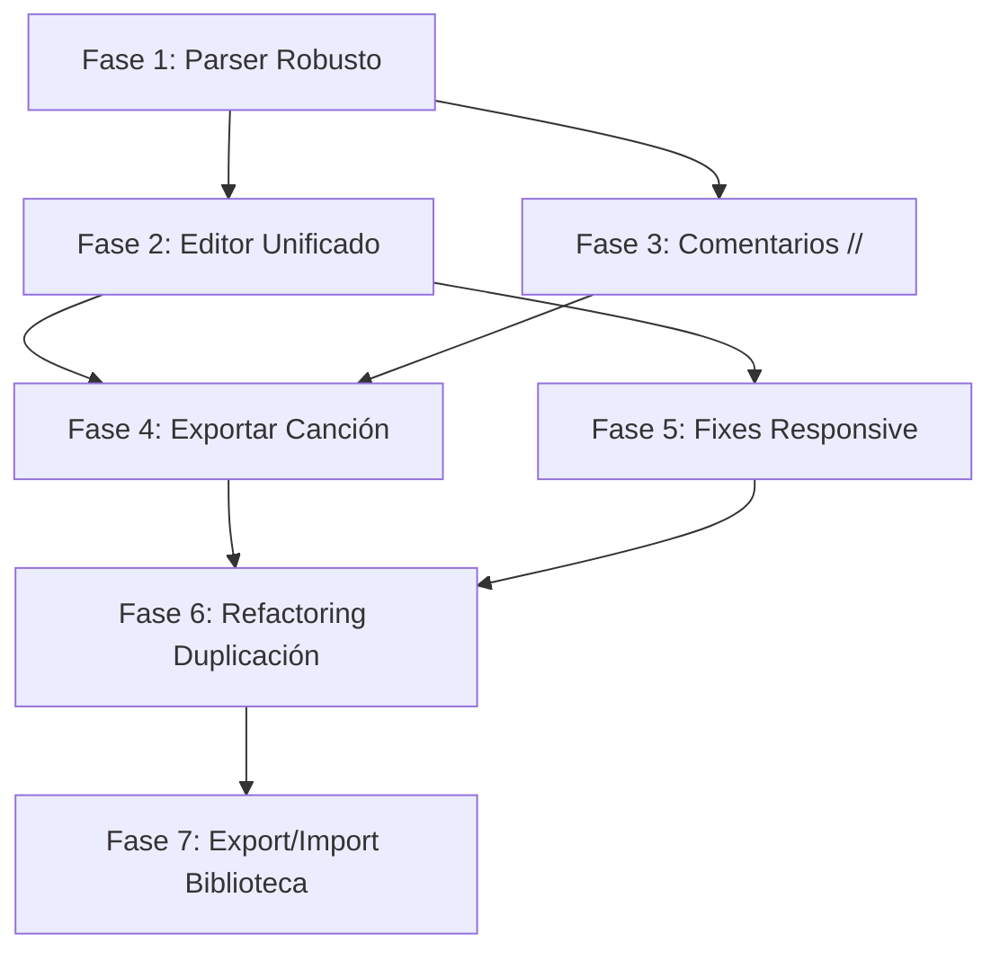

# ChordVault — Plan de Refactoring Definitivo v2.0

> [!NOTE]
> Este plan es **autocontenido**. Cada fase describe exactamente qué archivos modificar, qué cambiar, y cómo verificar. Si se interrumpe el trabajo, cualquier IA puede continuar desde la fase donde se dejó, consultando el `task.md` para ver progreso.

---

## Contexto del Proyecto

**ChordVault** es una app Flutter para músicos que permite almacenar canciones en cifrado americano, agruparlas en "notas" (setlists para tocar en vivo), y transponer tonos rápidamente.

**Arquitectura actual:**
- **Modelos**: `Block` (text/chords/note), `Song` (título, bloques, tono), `Note` (título, lista de songs)
- **Persistencia**: Hive con adapters manuales (typeIds: Block=10, Song=11, Note=12)
- **State**: Riverpod (StateNotifier para notes, library, settings)
- **Screens**: HomeScreen (notas), NoteEditorScreen (editar nota/songs), LibraryScreen (biblioteca), SongPreviewScreen (preview), HelpScreen

**Regla fundamental**: Los modelos Hive NO cambian de estructura. No se requiere migración de datos.

---

## Fase 1: Parser Robusto

**Objetivo**: Reescribir parser y transposición para manejar todos los casos edge correctamente.

### Bugs a corregir

1. **`(A/E-D)` falla al transponer** — `transposeToken` tiene lógica ambigua: el branch de paréntesis (L144-183) conflictúa con el branch de dash (L187-194). Se transpone parcialmente dos veces.
2. **Doble escape en `parseLineToTokens`** — `RegExp(r'\\s+')` es literal `\s+`, debería ser `RegExp(r'\s+')`. Funciona por casualidad.
3. **Falsos positivos** — `_looksLikeChordToken` acepta cualquier token que empiece con A-G: "Amor", "Dios", "ESTROFA" pasarían como acordes.

### Archivos a modificar

#### [MODIFY] [parser.dart](file:///home/salvador/windows/salvi/cancionero/lib/services/chords/parser.dart)

Reescribir completamente. La nueva implementación debe:

- Usar regex estricta que valide sufijos de acorde (no solo "empieza con A-G"):
  - Raíz: `[A-G]` + accidental opcional `(#|b|♯|♭)?`
  - Calidad: `(m(?!aj)|min|maj|M|aug|dim|\+|°|ø)?`
  - Extensión: `(2|4|5|6|7|9|11|13)?`
  - Suspendidas: `(sus[24]?)?`
  - Add: `(add(2|4|9|11|13))?`
  - Alteraciones: `((#|b)(5|7|9|11|13))*`
  - Bajo slash: `(/[A-G](#|b|♯|♭)?)?`
- Rechazar tokens como "Amor", "ESTROFA", "Dios", "Gloria" (tienen letras después que no son sufijos válidos)
- Fix del split: `RegExp(r'\s+')` (un solo backslash)
- Mantener la misma API: `parseLineToTokens(String line) → List<LineToken>`

#### [MODIFY] [transpose.dart](file:///home/salvador/windows/salvi/cancionero/lib/services/chords/transpose.dart)

Reescribir `transposeToken` con lógica limpia y sin ambigüedad. Algoritmo:

```
transposeToken(token, semitones, options):
  1. Si token está envuelto en paréntesis exteriores: strip → recurse → re-envolver
  2. Si token contiene '-': split por '-' → transponer cada parte → rejoin con '-'
  3. Parsear como chord (root + suffix + /bass) con parseChordToken
  4. Si no parsea → retornar original
  5. Transponer root, transponer bass si existe → reconstruir
```

El orden importa: paréntesis primero, luego dash, luego chord simple. Sin branches paralelos que conflictúen. `parseChordToken` se mantiene igual (ya funciona bien).

#### [NEW] [test/parser_test.dart](file:///home/salvador/windows/salvi/cancionero/test/parser_test.dart)

Tests unitarios cubriendo:

| Input | Esperado como chord? | Transposición +2 |
|-------|----------------------|-------------------|
| `A` | ✅ | `B` |
| `Am7` | ✅ | `Bm7` |
| `E/G#` | ✅ | `F#/A#` |
| `(A/E-D)` | ✅ | `(B/F#-E)` |
| `F#5b-F` | ✅ | `G#5b-G` |
| `Bbmaj7` | ✅ | `Cmaj7` |
| `Dsus4` | ✅ | `Esus4` |
| `Amor` | ❌ | — |
| `ESTROFA` | ❌ | — |
| `Dios` | ❌ | — |
| `x2` | ❌ | — |

**Verificación**: `flutter test test/parser_test.dart`

---

## Fase 2: Editor Unificado de Texto (Nuevo Flujo de Agregar Canción)

**Objetivo**: Eliminar la fricción del flujo actual donde hay que agregar bloques uno por uno.

### Problema actual

Flujo actual para agregar una canción:
1. FAB → "Añadir canción" → crea Song con título "Nueva canción"
2. Se abre editor → escribir título → escribir tono
3. "Agregar etiqueta" → siempre pone "INTRO" hardcodeado → hay que editarlo
4. "Agregar acordes" → escribir acordes
5. Repetir pasos 3-4 para cada sección (ESTROFA, CORO, PUENTE...)
6. Cada sección requiere 2-3 acciones mínimas

**~15 acciones para una canción de 4 secciones.**

### Solución: Editor de texto unificado

El usuario escribe/pega la canción completa en UN campo de texto:
```
INTRO
D

ESTROFA
D A Bm G

CORO
D A Bm G
```

Al guardar, `TextFormat._parseSingleSong` convierte a bloques automáticamente.

### Detalle clave: Detección sin líneas en blanco

Los músicos escriben frecuentemente SIN líneas intermedias:
```
ESTROFA
A B C D
CORO
A B C D
```

Esto debe funcionar. El parser `TextFormat` debe detectar section headers seguidos directamente de chord lines. La lógica: si una línea es `_isSectionHeader`, se crea un bloque text, independientemente de si hay línea en blanco antes o no.

**Verificar que `_isSectionHeader` ya maneja esto** — Actualmente sí, porque itera línea por línea y no requiere blank line previa. ✅ Solo hay que asegurarse de que el preview lo muestre correctamente.

### Archivos a modificar

#### [NEW] [lib/screens/widgets/song_text_editor.dart](file:///home/salvador/windows/salvi/cancionero/lib/screens/widgets/song_text_editor.dart)

Widget reutilizable `SongTextEditor`:

**Parámetros**:
- `Song? initialSong` — si es null, es una canción nueva
- `Function(Song) onSave` — callback al guardar

**UI**:
- Campo `Título` (pre-lleno si se edita)
- Campo `Tono` opcional (pre-lleno si existe)
- Área de texto grande (el contenido se inicializa con `TextFormat.blocksToText(blocks)` si se edita, vacío si es nuevo)
- Preview en vivo debajo del textarea mostrando la canción parseada
- Toggle "Vista avanzada" → abre el editor de bloques actual (como fallback)
- Botón "Guardar"

**Flujo de guardado**:
1. Tomar título del campo
2. Tomar tono del campo
3. Parsear el textarea con `TextFormat._parseSingleSong(text, id)`
4. Crear Song con bloques resultantes
5. Llamar `onSave(song)`

#### [MODIFY] [text_format.dart](file:///home/salvador/windows/salvi/cancionero/lib/services/io/text_format.dart)

Agregar método nuevo `blocksToText`:
```dart
static String blocksToText(List<Block> blocks) {
  // Convierte bloques de vuelta a texto editable
  // BlockType.text → contenido en mayúsculas (ya son etiquetas)
  // BlockType.chords → contenido tal cual
  // BlockType.note → "// contenido"  (ver Fase 3)
  // Separar bloques con línea en blanco
}
```

Agregar más section headers reconocidos en `_isSectionHeader`:
- Actuales: INTRO, ESTROFA, CORO, PUENTE, INTERLUDIO
- Agregar: PRE-CORO, PRECORO, OUTRO, FINAL, VERSO, BRIDGE, CHORUS, PRE-CHORUS, INTERLUDE, SOLO, INSTRUMENTAL, ENDING, TAG, VAMP

#### [MODIFY] [note_editor_screen.dart](file:///home/salvador/windows/salvi/cancionero/lib/screens/note_editor_screen.dart)

- **`_SongEditorSheet`**: Reemplazar contenido por `SongTextEditor(initialSong: song, onSave: ...)`. Eliminar todo el código duplicado del editor de bloques.
- **FAB "Añadir canción"** (L360-389): En vez de crear Song vacía y abrir editor, abrir directamente `SongTextEditor(initialSong: null, onSave: ...)`.
- **Fix del título**: Ya no se crea con "Nueva canción" — el SongTextEditor empieza con campo título vacío y placeholder "Título de la canción".

#### [MODIFY] [library_screen.dart](file:///home/salvador/windows/salvi/cancionero/lib/screens/library_screen.dart)

- **`_LibrarySongEditor`**: Reemplazar por `SongTextEditor`. Eliminar código duplicado del editor de bloques (L418-586).

---

## Fase 3: Comentarios Explícitos con `//`

**Objetivo**: Hacer los comentarios/notas dentro de canciones explícitos y visualmente diferenciados.

### Diseño

- **Sintaxis de escritura**: `// texto del comentario`
- **En el editor de texto unificado**: el usuario escribe `// ralentando aquí` como una línea normal
- **En la card de canción (vista)**: se renderiza en **itálica** con color más tenue, claramente diferente de las etiquetas (que son **bold** y más grandes)
- **En el parser**: líneas que empiezan con `//` se convierten en `Block(type: BlockType.note, content: "texto sin //")`

### Visual diferenciación en `_SongCard`

| Tipo | Estilo visual |
|------|--------------|
| Etiqueta (text) | **BOLD, MAYÚSCULAS**, font más grande, color primario |
| Acordes (chords) | `monospace`, fondo surfaceVariant |
| Comentario (note) | *Itálica*, color onSurface con opacidad 0.6, prefijo "💬" o icono sutil |

### Archivos a modificar

#### [MODIFY] [text_format.dart](file:///home/salvador/windows/salvi/cancionero/lib/services/io/text_format.dart)

- `_isNoteLine`: ya detecta `//` prefijo ✅
- `blocksToText`: exportar BlockType.note como `// contenido`
- `exportSong`: exportar BlockType.note como `// contenido` (actualmente lo omite o exporta como texto plano)

#### [MODIFY] [note_editor_screen.dart](file:///home/salvador/windows/salvi/cancionero/lib/screens/note_editor_screen.dart)

- En `_SongCard`, el render de `BlockType.note` (L567-576): aplicar estilo diferenciado (itálica, opacidad, icono)

#### [MODIFY] [song_preview_screen.dart](file:///home/salvador/windows/salvi/cancionero/lib/screens/song_preview_screen.dart)

- En `_buildBlock` para `BlockType.note` (L231-253): mismo estilo diferenciado

#### [MODIFY] [help_screen.dart](file:///home/salvador/windows/salvi/cancionero/lib/screens/help_screen.dart)

- Actualizar documentación para mencionar la sintaxis `//` para comentarios

---

## Fase 4: Exportar Canción como Texto

**Objetivo**: Poder exportar cualquier canción como texto plano al clipboard o compartir por WhatsApp/etc.

### Formato de exportación

```
CANCION (TONO)
INTRO
D

ESTROFA
D A Bm G

// comentario si hay

CORO
D A Bm G
```

Esto es exactamente lo que `TextFormat.exportSong(song)` ya produce (verificar que incluya comentarios con `//`).

### Archivos a modificar

#### [MODIFY] [note_editor_screen.dart](file:///home/salvador/windows/salvi/cancionero/lib/screens/note_editor_screen.dart)

En `_SongCard`, agregar al `PopupMenuButton` (L520-543):
```dart
PopupMenuItem(value: 'export_text', child: Text('Copiar como texto')),
PopupMenuItem(value: 'share', child: Text('Compartir')),
```

Acciones:
- `export_text`: `Clipboard.setData(ClipboardData(text: TextFormat.exportSong(song)))` + SnackBar confirmación
- `share`: `Share.share(TextFormat.exportSong(song))` usando `share_plus` (ya en pubspec)

Agregar import: `import 'package:share_plus/share_plus.dart';`

#### [MODIFY] [song_preview_screen.dart](file:///home/salvador/windows/salvi/cancionero/lib/screens/song_preview_screen.dart)

Agregar mismas opciones al `PopupMenuButton` (L119-164):
```dart
PopupMenuItem(value: 'export_text', child: ...),
PopupMenuItem(value: 'share', child: ...),
```

Implementar `_editSong` correctamente: abrir `SongTextEditor` en modal bottom sheet en vez del SnackBar actual.

---

## Fase 5: Fixes de Responsive y Bugs de UI

**Objetivo**: Corregir bugs gráficos y de lógica sin cambiar diseño visual.

### Bugs a corregir

#### 1. AppBar overflow en SongPreviewScreen
**Archivo**: [song_preview_screen.dart](file:///home/salvador/windows/salvi/cancionero/lib/screens/song_preview_screen.dart)

La AppBar tiene: transposición (4 widgets) + font controls (3 widgets) + menú = 8+ widgets. Se desborda en pantallas < 400dp.

**Fix**: Mover controles de transposición y fuente a una barra debajo del AppBar (un `PreferredSize` widget o un container fijo en el body).

#### 2. Lógica imposible en insertToNote
**Archivos**: [library_screen.dart:L265](file:///home/salvador/windows/salvi/cancionero/lib/screens/library_screen.dart#L265), [song_preview_screen.dart:L372](file:///home/salvador/windows/salvi/cancionero/lib/screens/song_preview_screen.dart#L372)

`if (result != null || result == null)` siempre es `true`. No distingue "cancelar" de "nueva nota" porque ambos retornan `null`.

**Fix**: Usar un valor sentinel. Cambiar "Nueva nota" a retornar un `Note` especial con id vacío, y detectar cancelación por `result == null`.

#### 3. TextEditingController creado en build
**Archivos**: [note_editor_screen.dart:L794-795](file:///home/salvador/windows/salvi/cancionero/lib/screens/note_editor_screen.dart#L794-L795), [library_screen.dart:L574](file:///home/salvador/windows/salvi/cancionero/lib/screens/library_screen.dart#L574)

`TextEditingController(text: b.content)` se crea dentro de `itemBuilder` → recrea en cada rebuild → pierde cursor.

**Fix**: Esto se resuelve con el editor unificado de la Fase 2 (el editor de bloques se usa menos). Para el fallback "Vista avanzada", usar un `Map<String, TextEditingController>` persistente.

#### 4. Botón Importar deshabilitado incorrectamente
**Archivo**: [library_screen.dart:L684](file:///home/salvador/windows/salvi/cancionero/lib/screens/library_screen.dart#L684)

El check `_textController.text.trim().isEmpty` no se re-evalúa al escribir. Falta listener.

**Fix**: Convertir a StatefulWidget con `_textController.addListener(() => setState(() {}))` en initState.

#### 5. FAB posicionamiento manual frágil
**Archivo**: [home_screen.dart:L326-367](file:///home/salvador/windows/salvi/cancionero/lib/screens/home_screen.dart#L326-L367)

Usa `Stack` + `Positioned` con offsets hardcodeados. El FAB de ayuda queda en posición absoluta que puede chocar con el contenido.

**Fix**: Mover el botón de ayuda al AppBar como acción, dejando solo el FAB de "+" como floating action button estándar.

#### 6. _editSong no funciona
**Archivo**: [song_preview_screen.dart:L456-466](file:///home/salvador/windows/salvi/cancionero/lib/screens/song_preview_screen.dart#L456-L466)

Solo muestra SnackBar. Debe abrir el editor.

**Fix**: Abrir `SongTextEditor` en modal bottom sheet (disponible tras Fase 2).

#### 7. Eliminar archivo backup
**Archivo**: [DELETE] [library_screen_backup.dart](file:///home/salvador/windows/salvi/cancionero/lib/screens/library_screen_backup.dart)

---

## Fase 6: Refactoring de Código Duplicado

**Objetivo**: Eliminar duplicación masiva y mejorar mantenibilidad.

### Duplicaciones encontradas

| Código | Ubicaciones | Solución |
|--------|-------------|----------|
| `_displayTitleWithKey()` | home_screen.dart:L378, note_editor_screen.dart:L592 | Extraer a utils |
| Lógica "insertar canción en nota" | library_screen.dart:L218-351, song_preview_screen.dart:L299-453, note_editor_screen.dart:L336-354 | Extraer a widget compartido |
| Editor de bloques | library_screen.dart:L418-586, note_editor_screen.dart:L646-846 | Reemplazado por SongTextEditor (Fase 2) |

### Archivos nuevos

#### [NEW] [lib/utils/title_utils.dart](file:///home/salvador/windows/salvi/cancionero/lib/utils/title_utils.dart)

```dart
String displayTitleWithKey(String title, String? originalKey, int semitones, {bool preferSharps = true}) {
  // Extraer de home_screen.dart:L378-390
  // Única fuente de verdad
}
```

#### [NEW] [lib/screens/widgets/insert_to_note_dialog.dart](file:///home/salvador/windows/salvi/cancionero/lib/screens/widgets/insert_to_note_dialog.dart)

```dart
Future<void> insertSongsToNote(BuildContext context, WidgetRef ref, List<Song> songs) async {
  // Lógica unificada:
  // 1. Mostrar bottom sheet con lista de notas + opción "Nueva nota"
  // 2. Si elige nota existente → agregar songs
  // 3. Si elige nueva → pedir título → crear nota → agregar songs
  // 4. Navegar a la nota
  // Usar valor sentinel para distinguir cancelar vs nueva nota
}
```

### Archivos a modificar

- **home_screen.dart**: Importar y usar `displayTitleWithKey` de utils
- **note_editor_screen.dart**: Importar y usar `displayTitleWithKey` de utils. Usar `insertSongsToNote` donde aplique.
- **library_screen.dart**: Usar `insertSongsToNote`. Eliminar código duplicado.
- **song_preview_screen.dart**: Usar `insertSongsToNote`. Eliminar `_insertToNote` local.

---

## Fase 7: Exportar/Importar Biblioteca como Archivo

**Objetivo**: Permitir exportar toda la biblioteca (o canciones seleccionadas) como un archivo que se pueda compartir e importar en otro dispositivo.

### Diseño del formato

**Formato**: Archivo JSON con extensión `.chordvault`

```json
{
  "format": "chordvault_library",
  "version": 2,
  "exportedAt": "2026-04-22T12:00:00Z",
  "songs": [
    {
      "title": "Glorioso Dia",
      "originalKey": "D",
      "tags": [],
      "author": null,
      "blocks": [
        {"type": "text", "content": "INTRO"},
        {"type": "chords", "content": "D"},
        ...
      ]
    },
    ...
  ]
}
```

> [!NOTE]
> Este formato es similar al de `song_clipboard.dart` pero para múltiples canciones. La estructura `_songToMap` existente se reutiliza.

### Flujo de Exportación

1. Usuario va a Biblioteca → Modo selección (long press) → Selecciona canciones
2. Botón "Exportar archivo" en bottom bar (nuevo, junto a los existentes)
3. Se genera archivo `.chordvault` temporal
4. Se abre share sheet nativo (WhatsApp, email, Bluetooth, etc.) con el archivo
5. Usa `share_plus` con `Share.shareXFiles([XFile(path)])`

### Flujo de Importación

1. Usuario va a Biblioteca → Botón "Importar" en AppBar (ya existe el de texto)
2. Agregar segundo botón o cambiar el actual a un menú con opciones: "Importar texto" / "Importar archivo .chordvault"
3. Para archivo: abrir file picker → seleccionar `.chordvault` → parsear JSON
4. **Chequeo de duplicados**: Para cada canción importada, comparar con las existentes en biblioteca. Una canción es "exactamente igual" si `title`, `originalKey`, y todos los `blocks` (type + content) son idénticos.
5. Si hay duplicados → mostrar resumen: "X canciones nuevas, Y ya existentes (omitidas)"
6. **Loading indicator**: Si hay >20 canciones, mostrar `CircularProgressIndicator` con texto "Importando X canciones..."
7. Importar solo las nuevas → actualizar state

### Archivos a modificar

#### [NEW] [lib/services/io/library_file.dart](file:///home/salvador/windows/salvi/cancionero/lib/services/io/library_file.dart)

```dart
class LibraryFile {
  /// Serializa lista de songs a JSON string (formato .chordvault)
  static String exportToJson(List<Song> songs);
  
  /// Parsea JSON string a lista de songs
  static List<Song> importFromJson(String json);
  
  /// Compara dos songs para ver si son exactamente iguales
  static bool areSongsEqual(Song a, Song b);
  
  /// Filtra songs que ya existen en la biblioteca
  static List<Song> filterDuplicates(List<Song> toImport, List<Song> existing);
}
```

#### Dependencia nueva en pubspec.yaml

Agregar `file_picker` para seleccionar archivos:
```yaml
dependencies:
  file_picker: ^8.0.0
```

O alternativamente usar `share_plus` para exportar y manejar el intent de archivo `.chordvault` para importar. Evaluar la opción más simple.

> [!NOTE]
> Otra opción sin file_picker: el usuario puede pegar el contenido JSON del archivo en un campo de texto (similar a la importación actual). Pero esto es menos user-friendly. **Recomendación**: usar `file_picker` para importar y `share_plus` + `path_provider` (ya en deps) para exportar.

#### [MODIFY] [library_screen.dart](file:///home/salvador/windows/salvi/cancionero/lib/screens/library_screen.dart)

- Agregar botón de importar archivo en AppBar (junto al de importar texto actual, o reemplazar por menú)
- Agregar botón "Exportar archivo" en la bottom bar del modo selección
- Mostrar diálogo de progreso durante importación grande
- Mostrar resumen post-importación (nuevas vs duplicadas)

#### [MODIFY] [pubspec.yaml](file:///home/salvador/windows/salvi/cancionero/pubspec.yaml)

Agregar `file_picker: ^8.0.0`

---

## Orden de Ejecución



**Fases 1 y 3** son independientes y se pueden hacer en paralelo.  
**Fase 2** depende de Fase 1 (usa el parser mejorado).  
**Fase 4** depende de Fases 2 y 3.  
**Fase 5** se puede hacer en cualquier momento después de Fase 2.  
**Fase 6** consolida todo el refactoring.  
**Fase 7** es independiente y se hace al final.

---

## Resumen de Archivos

| Acción | Archivo | Fase |
|--------|---------|------|
| MODIFY | `lib/services/chords/parser.dart` | 1 |
| MODIFY | `lib/services/chords/transpose.dart` | 1 |
| NEW | `test/parser_test.dart` | 1 |
| NEW | `lib/screens/widgets/song_text_editor.dart` | 2 |
| MODIFY | `lib/services/io/text_format.dart` | 2, 3 |
| MODIFY | `lib/screens/note_editor_screen.dart` | 2, 3, 4, 5 |
| MODIFY | `lib/screens/library_screen.dart` | 2, 4, 5, 7 |
| MODIFY | `lib/screens/song_preview_screen.dart` | 3, 4, 5 |
| MODIFY | `lib/screens/help_screen.dart` | 3 |
| NEW | `lib/utils/title_utils.dart` | 6 |
| NEW | `lib/screens/widgets/insert_to_note_dialog.dart` | 6 |
| MODIFY | `lib/screens/home_screen.dart` | 5, 6 |
| NEW | `lib/services/io/library_file.dart` | 7 |
| MODIFY | `pubspec.yaml` | 7 |
| DELETE | `lib/screens/library_screen_backup.dart` | 5 |

## Verification Plan

### Per-Phase Tests
- **Fase 1**: `flutter test test/parser_test.dart` + manual con `(A/E-D)`, `E/G#`, `Bbmaj7`
- **Fase 2**: Manual — crear canción pegando texto, verificar bloques generados
- **Fase 3**: Manual — escribir `// comentario`, verificar render diferenciado
- **Fase 4**: Manual — exportar canción, verificar texto en clipboard, compartir por WhatsApp
- **Fase 5**: `flutter analyze` + manual en pantallas pequeñas
- **Fase 6**: `flutter analyze` — verificar que no hay imports rotos
- **Fase 7**: Manual — exportar .chordvault, importar en otra instancia, verificar deduplicación

### Final
- `flutter analyze` — 0 warnings
- `flutter test` — all pass
- `flutter build apk --debug` — compila sin errores
